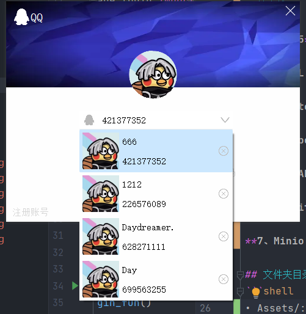

# 基于PyQt5实现仿QQ
*Author: Daydreamer*

# 项目简介

本项目基于PyQt5仿照目前流行的即时通信软件QQ，实现了新用户注册、用户登录、自动登录、记住多用户账号、用户搜索、添加好友、好友间聊天（消息持久化、同步化）等功能。

#  项目演示





# 技术栈

- **PyQt5**:  本项目界面基于PyQt5实现。
- **MySQL:**  项目中的用户个人信息表、好友聊天记录表、好友表均由MySQL实现。
- **SQLite:**  使用SQLite将用户的账号密码存储于本地，实现了自动登录功能。
- **WebSocket:** 项目聊天功能基于WebSocket实现。
- **FastAPI:** 使用FastAPI将WebSocket服务部署到服务器，实现了任意IP间的通信。
- **RabbitMQ:** 基于RabbitMQ消息队列实现了消息真正的持久化（不存在好友离线接收不到消息），当用户一上线立刻会收到新消息。
- **Minio:** 基于Minio云存储服务器存储用户的头像、聊天记录中的图片、问价、视频等资源。

## 文件夹目录规范
```shell
• Assets/: 存放界面重写模组代码，如：用户切换下拉框模组等等
• core/: 存放业务逻辑相关代码
• db/: 存放操作数据库相关文件，主要用于与数据库交互
• lib/: 存放程序中常用的自定义模块
• conf/: 存放配置文件
• page/: 各个界面的实现文件
• static/: 存放静态文件
• ui/: 存放ui文件
• run.py: 程序的启动文件，一般放在项目的根目录下，因为在运行时会默认将运行文件所在的文件夹作为sys.path的第一个路径，这样就省去了处理环境变量的步骤
• setup.py: 安装、部署、打包的脚本。
• requirements.txt: 存放软件依赖的外部Python包列表。
• README: 项目说明文件。
```

## 数据库选型

MySQL -> 用户的账号密码个人信息

Sqlite -> 登陆时的历史记录

**特别鸣谢：LoadingCreate ҈҉҈҉҈҉҈对我的帮助！**
